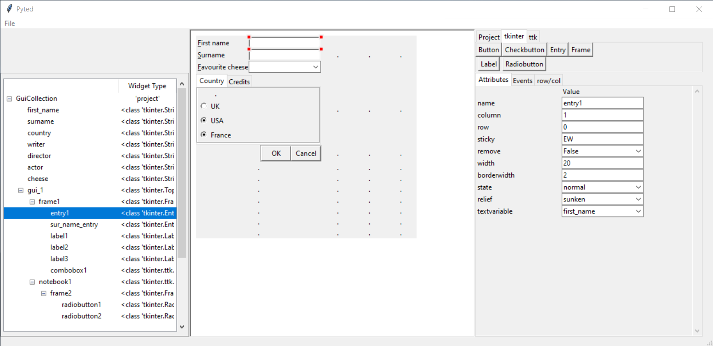
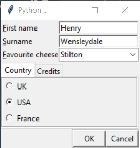

# Introduction

Pyted (Python tkinter Editor) is an experimental Python drag and drop tkinter editor that allows a tkinter window to be
designed and saved to a file. The saved file is Python code that can be used without any dependencies.

 

The aim of pyted is to develop a program that it is easy to create a user GUI, and for that GUI to be simply
implemented as part of a python program. The above user GUI can be save and used by the following python script.

    import character_gui

    my_dict = {'first_name': 'Henry', 'country': 'USA'}
    gui = character_gui.gui_1(my_dict)
    print(my_dict)

When the script is run the following dialogue box is displayed.

The GUI is initialised by the python script to display initial values, with the final values when the GUI is
closed is passed back to the python script. In that way information into and out of the GUI is well defined.

Interactive GUIs can be created, where tkinter events can be linked to functions. This aspect is more experimental
at present.